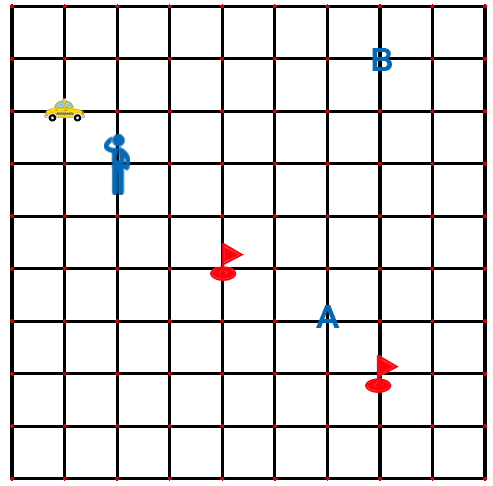
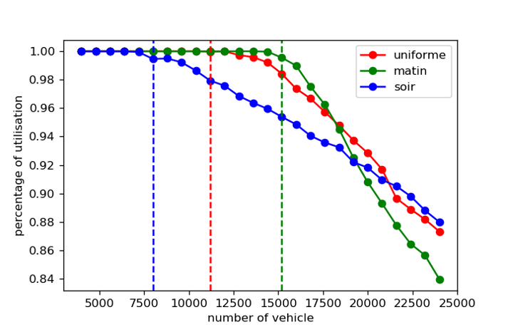
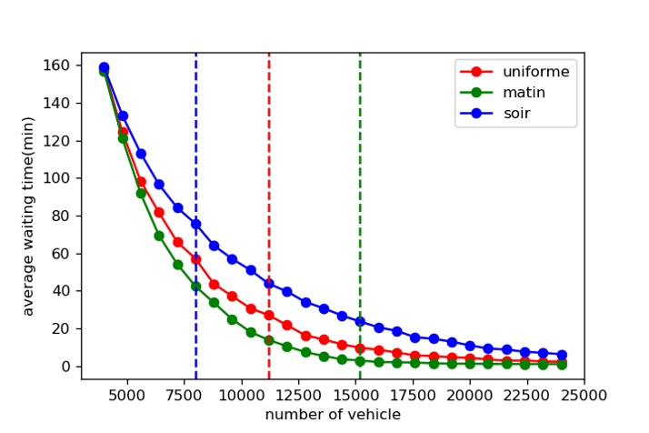
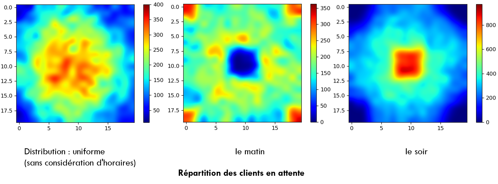

# Projet scientifique collectif(PSC) 

Sep. 2018 - May. 2019

This project is under the supervision of Renault and Departement of mathematics and Management in École Polytechnique, 
concerns the optimisation of robot-taxi service(driveless, electrical, sharing, dynamic dispatching). According to the ambition of Renault, 
we may be able to see robot-taxi serve in Paris in 2022.

Our works focused on the fleet-sizing and pricing, composed by two parts: Mathematical modeling and JAVA simulation. 
What you see here is the Java simulation.  

----
### The model:

The city is segmented into a square grid, there is a dispatching algorithme to distribute a taxi to a client and to share a ride between clients.

### Some demonstrations of our results:

rate of utilisation

waiting time of client

The waiting client distribution fluctuate in time:

spatial client distribution fluctuation in time

---------
### Our final result: 

In the case of Paris, we need 8600 robot-taxi to satisfy all clients instead of the current number 16000!